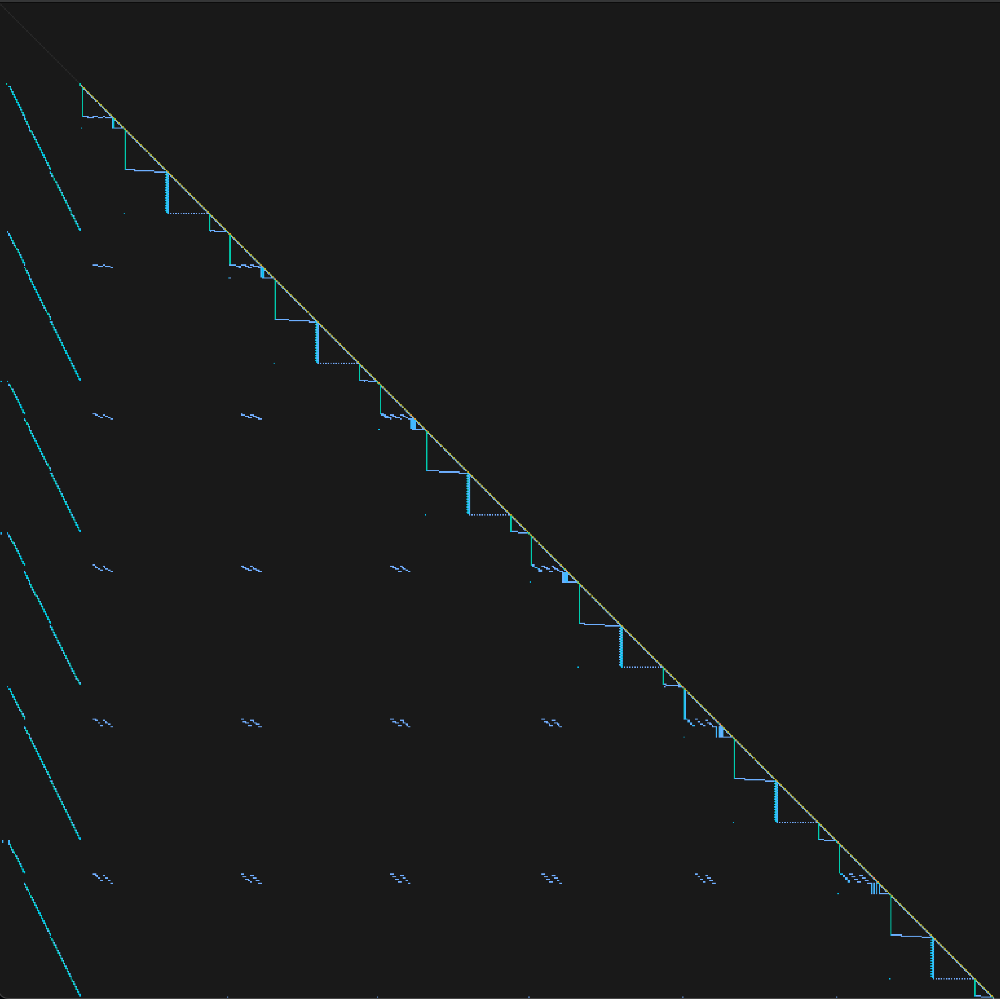

# microgpt.c

Karpathy's [microgpt.py](https://gist.github.com/karpathy/8627fe009c40f57531cb18360106ce95) ported to C with scalar autograd, arena allocators, and an SDL3 UI.

Every floating-point operation — every multiply, every add — is a node on an arena-backed tape. No matrices, no tensors, just scalars. The tape *is* the topological order, so backward is a single reverse scan.

A character-level GPT trained on names (~4K params, 60K computation nodes per step) generates things like *ahera*, *maran*, *zavi*.

## spy plot

What a GPT forward pass looks like when every scalar op is a node in the computation graph. The architecture — attention heads, MLP, residual connections — is legible in the raw sparsity pattern.



## build

`sh build.sh` or:

```
cc -O2 -o main main.c $(pkg-config --cflags --libs sdl3)
```

Needs SDL3, a TTF font (`SourceCodePro-Regular.ttf`),

has datasets in `data/`:
- MNIST (IDX format)
- [`names.txt`](https://raw.githubusercontent.com/karpathy/makemore/refs/heads/master/names.txt)

```
./main          # UI (browse, train CNN, train GPT spy plot)
```
